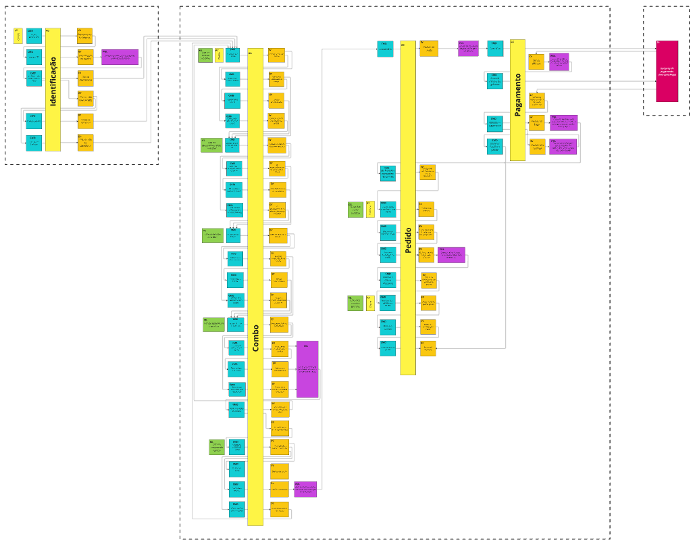

<div align="center">

# Pós Tech FIAP - Tech Challenge - Grupo 12


<br>

</div>

### 👨‍💼👩‍💼‍ Autores

Este é um projeto que está em construção pelos desenvolvedores:


<br>

<br>

<br>

<br>


## 💻 Descrição

Este monolito é responsável por gerenciar a entrada de pedidos de um restaurante. Ele lida com o processamento dos
pedidos, gerenciamento de pagamentos e envio dos pedidos para a cozinha após a confirmação do pagamento.

## 🛠 Tecnologias Utilizadas


## 💫 Arquitetura

O projeto segue a Arquitetura Hexagonal (Ports and Adapters), permitindo maior flexibilidade e facilidade de manutenção.

## ⚙️ Configuração

### Pré-requisitos

#### Desenvolvimento

- **[Java 21](https://docs.oracle.com/en/java/javase/21/)**: Documentação oficial do Java 21.
- **[Maven 3.6.3+](https://maven.apache.org/)**: Site oficial do Maven.
- **[Docker](https://www.docker.com/)**: Site oficial do Docker.
- **[Docker Compose](https://docs.docker.com/compose/)**: Documentação oficial do Docker Compose.

#### Execução Local

- Docker Compose

### 🐳 Imagem Docker

A imagem docker desse projeto foi buildada através do arquivo `Dockerfile` presente neste repositório, e enviada a um
container registry (Docker HUB). Para visualizá-la, basta acessar o
link: https://hub.docker.com/r/willosouza/fiap-soat-tech-challenge

### 🚀 Execução

#### Subindo a aplicação via docker compose

Este projeto conta com um arquivo `docker-compose.yml` que pode ser utilizado para subir o container da aplicação e suas
respectivas dependências (banco de dados).

Para subir as aplicações, primeiro se faz necessária a existência de um arquivo `.env` na raiz do projeto, para que as
variáveis de ambiente sejam definidas. Esse projeto já conta com um arquivo versionado nesse repositório, para que a
definição das variáveis não precise ser feita. Abaixo segue a estrutura desse arquivo:

```sh
POSTGRES_URL=<url_do_banco_de_dados>
POSTGRES_DB=<nome_do_banco_de_dados>
POSTGRES_USERNAME=<usuário_do_banco_de_dados>
POSTGRES_PASSWORD=<senha_do_usuário_no_banco_de_dados>
```

Após se certificar que o arquivo `.env` existe e está definindo as variáveis citadas acima, basta executar o
comando `docker compose up` para iniciar o build da imagem da aplicação (Definida no arquivo `Dockerfile`) e realizar a
inicialização do container do banco de dados (Postgres) seguido pelo container da aplicação.

Caso tudo dê certo, as seguintes linhas de log devem ter sido exibidas no terminal cujo comando foi executado:

- Pull da imagem do postgres:


- Build da imagem da aplicação utilizando o conteúdo do Dockerfile:


- Criando volume e containers:


- Container do postgres de pé e rodando com sucesso


- Container da aplicação de pé e rodando com sucesso


Após todos esses passos, basta rodar o comando `docker container ls` para verificar quais containers estão sendo
executados. Caso tudo tenha corrido com sucesso, o comando deve ter o seguinte resultado:


Por fim, o serviço estará disponível em `http://localhost:8357` com contextPath `/api`

Obs: Caso queira subir os containers no modo `detached`(Sem travar o terminal em que o comando for executado), basta
rodar o seguinte comando: `docker compose up -d`


### 🛒 Fake Checkout

Nessa fase do pejeto, disponibilizamos um recurso para realizar o pagamento de um pedido de forma manual.
Após gerar um pedido, é possível chamar o endpoint PUT `/v1/fake-checkout`, informando no body o id do pedido gerado.
Ao realizar a chamada, se o pedido estiver no status inicial (`RECEIVED`), ele será atualizado para
o status `PREPARING`, com a informação de que foi pago. Caso o pedido não esteja no status inicial,
uma mensagem de erro será retornada informando que o pedido precisa estar no status `RECEIVED` para ser
atualizado.

### 📄 Documentação da API

Link para acessar ao swagger após subir a aplicação:

```bash
http://localhost:8357/api/swagger-ui/index.html
```


### 🎲 Seeds

Para facilitar o consumo e os testes da aplicação, seeds de dados foram criadas e gerenciadas utilizando o `Flyway`. 
Essas seeds são aplicadas automaticamente ao iniciar a aplicação, garantindo um ambiente consistente e pronto para uso.

### 📚 MIRO - Event Storming



Acesso ao MIRO com o Event Storming:
[Event Storming](https://miro.com/app/board/uXjVK1ekBDM=/)
