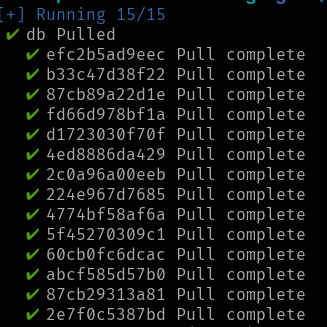
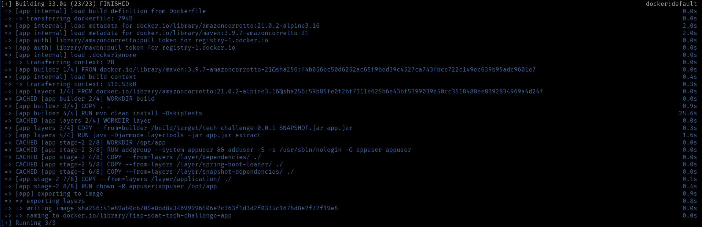
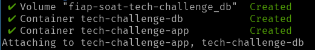
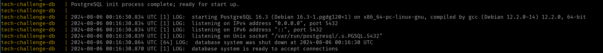
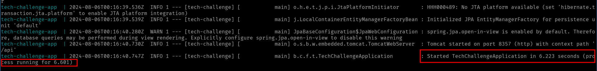
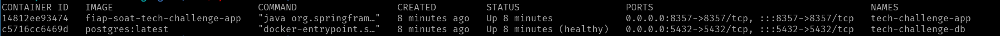
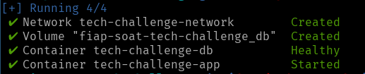

# Pós Tech - Tech Challenge Microservice

## Descrição

Este microserviço é responsável por gerenciar a entrada de pedidos de um restaurante. Ele lida com o processamento dos
pedidos, gerenciamento de pagamentos e envio dos pedidos para a cozinha após a confirmação do pagamento.

## Tecnologias Utilizadas

- **Java 21**
- **PostgreSQL**
- **Maven**
- **Spring Boot**
- **Spring Data JPA**
- **Docker**

## Arquitetura

O projeto segue a Arquitetura Hexagonal (Ports and Adapters), permitindo maior flexibilidade e facilidade de manutenção.

## Configuração

### Pré-requisitos

#### Desenvolvimento

- Java 21
- Maven 3.6.3+
- Docker
- Docker Compose

#### Execução Local

- Docker Compose

### Execução

#### Subindo a aplicação via docker compose

Este projeto conta com um arquivo `docker-compose.yml` que pode ser utilizado para subir o container da aplicação e suas respectivas dependências (banco de dados).

Para subir as aplicações, primeiro se faz necessária a existência de um arquivo `.env` na raiz do projeto, para que as variáveis de ambiente sejam definidas. Esse projeto já conta com um arquivo versionado nesse repositório, para que a definição das variáveis não precise ser feita. Abaixo segue a estrutura desse arquivo:

```sh
POSTGRES_URL=<url_do_banco_de_dados>
POSTGRES_DB=<nome_do_banco_de_dados>
POSTGRES_USERNAME=<usuário_do_banco_de_dados>
POSTGRES_PASSWORD=<senha_do_usuário_no_banco_de_dados>
```

Após se certificar que o arquivo `.env` existe e está definindo as variáveis citadas acima, basta executar o comando `docker compose up` para iniciar o build da imagem da aplicação (Definida no arquivo `Dockerfile`) e realizar a inicialização do container do banco de dados (Postgres) seguido pelo container da aplicação. 

Caso tudo dê certo, as seguintes linhas de log devem ter sido exibidas no terminal cujo comando foi executado:

- Pull da imagem do postgres:



- Build da imagem da aplicação utilizando o conteúdo do Dockerfile:



- Criando volume e containers:



- Container do postgres de pé e rodando com sucesso



- Container da aplicação de pé e rodando com sucesso



Após todos esses passos, basta rodar o comando `docker container ls` para verificar quais containers estão sendo executados. Caso tudo tenha corrido com sucesso, o comando deve ter o seguinte resultado:



Por fim, o serviço estará disponível em http://localhost:8357.

Obs: Caso queira subir os containers no modo `detached`(Sem travar o terminal em que o comando for executado), basta rodar o seguinte comando: `docker compose up -d`



### Contribuição

Este é um projeto que está em construção pelos desenvolvedores:

- Alexandre Miranda - RM357321
- Diego Ceccon - RM357437
- Jéssica Rodrigues - RM357218
- Rodrigo Sartori - RM358002
- Wilton Souza - RM357991

### Licença

Distribuído sob a licença MIT. Veja LICENSE para mais informações.